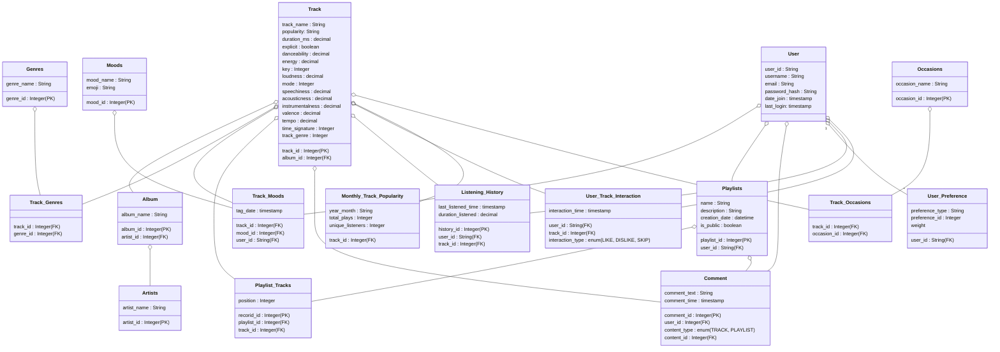

# Music Recommendation
SoundWave is a personalized music platform that offers mood-based playlists, dynamic music discovery, and real-time social interaction, catering to music lovers seeking more tailored recommendations, interactive features, and evolving playlists beyond the limitations of traditional services.
 
Features we plan to deliver this semester
1. ***Mood-Based Tagging***: Users can tag songs and playlists with emojis to represent the mood or vibe of the music (e.g., happy, sad, energetic). This data will later be used to filter songs and improve recommendations, allowing users to find music that matches their emotional state quickly.
2. ***Social Interaction***: Add a comment section for each song and playlist where users can engage in discussions, share opinions, and recommend similar tracks to others. This feature fosters community-building and deeper user engagement.
3. ***Dynamic Music Search***: Implement a real-time search feature that adapts based on user input. Users can filter songs by mood, genre, artist, occasions, or other attributes. The search results update dynamically as users refine their preferences, ensuring they find the perfect tracks tailored to both their personal taste and specific events or activities.
4. ***Personalized Music List Recommendations (Advanced Feature)***: Utilize user preferences, listening history, and behavior to generate personalized music recommendations. Over time, the platform will refine suggestions based on user feedback, such as favoring certain songs, avoiding specific genres, or skipping explicit content. Additionally, the system will offer alternative or similar music suggestions to enhance discovery.
5. ***Monthly Music Popularity (Advanced Feature)***: Analyze the popularity of tracks each month, using an algorithm that scores songs from 0 to 100 based on total and recent plays. This feature highlights the most popular songs of the moment and curates holiday-specific recommendations based on seasonal trends. Users can explore tracks that are trending now or revisit top songs from past months to create perfect playlists for upcoming holidays or special occasions.

