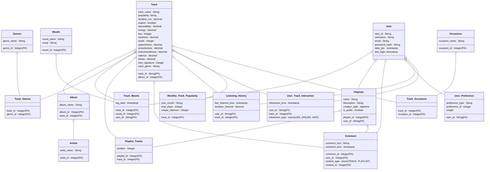

# Music Recommendation

```mermaid
classDiagram
    
    Track o-- Album
    Track o-- Track_Genres
    Track o-- Track_Moods
    Track o-- Playlist_Tracks
    Track o-- Comment
    Track o-- Listening_History
    Track o-- User_Track_Interaction
    Track o-- Monthly_Track_Popularity
    Track o-- Track_Occasions
    Album o-- Artists
    Genres o-- Track_Genres
    Moods o-- Track_Moods
    User o-- Track_Moods
    User o-- Playlists
    User o-- Comment
    User o-- User_Preference
    User o-- Listening_History
    User o-- User_Track_Interaction
    Occasions o-- Track_Occasions
    Playlists o-- Playlist_Tracks
    Playlists o-- Comment

    
    class Track{
        track_id : String (PK)
        track_name : String
        album_id : Integer (FK)
        popularity: String
        duration_ms : decimal
        explicit : boolean
        danceability : decimal
        energy : decimal
        key : Integer
        loudness : decimal
        mode : Integer
        speechiness : decimal
        acousticness : decimal
        instrumentalness : decimal
        valence : decimal
        tempo : decimal
        time_signature : Integer
        track_genre : String
    }
    class Album{
        album_id : Integer(PK)
        album_name : String
        artist_id : Integer (FK)
    }
    class Artists{
        artist_id : Integer (PK)
        artist_name : String
    }
    class User{
        user_id : String
        username : String
        email : String
        password_hash : String
        date_join : timestamp
        last_login: timestamp
    }
    class Genres{
        genre_id : Integer (PK)
        genre_name : String
    }
    class Track_Genres{
        track_id : Integer (FK)
        genre_id : Integer (FK)
    }
    class Moods{
        mood_id : Integer (PK)
        mood_name : String
        emoji : String
    }
    class Track_Moods{
        track_id : Integer (FK)
        mood_id : Integer (FK)
        user_id : String (FK)
        tag_date : timestamp
    }
    class Playlists{
        playlist_id : Integer(PK)
        user_id : String (FK)
        name : String
        description : String
        creation_date : datetime
        is_public : boolean
    }
    class Playlist_Tracks{
        playlist_id : Integer(FK)
        track_id : Integer (FK)
        position : Integer
    }
    class Comment{
        comment_id : Integer (PK)
        user_id : Integer (FK)
        content_type : enum(TRACK, PLAYLIST)
        content_id : Integer(FK)
        comment_text : String
        comment_time : timestamp
    }
    class User_Preference{
        user_id : String (FK)
        preference_type : String
        preference_id : Integer
        weight
    }
    class Listening_History{
        user_id : String (FK)
        track_id : Integer (FK)
        last_listened_time : timestamp
        duration_listened : decimal
    }
    class User_Track_Interaction{
        user_id : String (FK)
        track_id : Integer(FK)
        interaction_type : enum(LIKE, DISLIKE, SKIP)
        interaction_time : timestamp
    }
    class Monthly_Track_Popularity{
        track_id : Integer (FK)
        year_month : String
        total_plays : Integer
        unique_listeners : Integer
    }
    class Occasions{
        occasion_id : Integer (PK)
        occasion_name : String
    }
    class Track_Occasions{
        track_id : Integer (FK)
        occasion_id : Integer (FK)
    }

```
